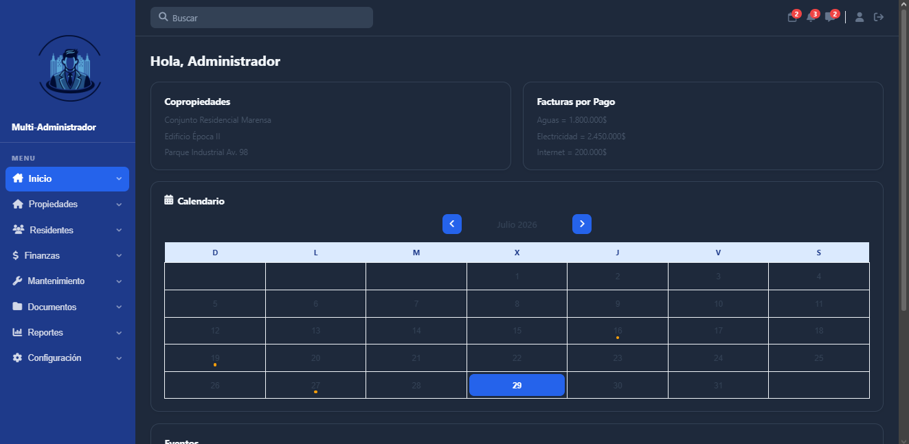

<p align="center">
  
</p>

<h1 align="center">Multi-Administrador</h1>

<p align="center">
Sistema Web para la Administración de Copropiedades y Conjuntos Residenciales
</p>

---

# Descripción

Multi-Administrador es una aplicación web desarrollada como proyecto formativo del SENA, cuyo objetivo es facilitar la administración de conjuntos residenciales y copropiedades.

El sistema permite centralizar la información de residentes, propiedades, finanzas, documentos y demás procesos administrativos en una sola plataforma y de forma rápida.

---

# Objetivo General

Desarrollar una plataforma web que permita optimizar la gestión administrativa de conjuntos residenciales mediante una aplicación moderna, segura y fácil de utilizar.

---

# Funcionalidades

- Inicio de sesión.
- Registro de usuarios.
- Recuperación de contraseña mediante correo electrónico.
- Gestión de residentes.
- Gestión de propiedades.
- Gestión financiera.
- Gestión documental.
- Gestión de mantenimiento.
- Reportes.
- Actas.
- Configuración del sistema.
- Perfil de usuario.
- Notificaciones.

---

# Tecnologías utilizadas

## Frontend

- React
- TypeScript
- Vite
- CSS
- FontAwesome

## Backend

- Python
- FastAPI
- SQLAlchemy
- Uvicorn

## Base de Datos

- PostgreSQL

## Control de versiones

- Git
- GitHub

---

# Arquitectura del Proyecto

```
Proyecto-Multi-Administrador
│
├── multi-admin-responsive
│   ├── src
│   ├── public
│   ├── package.json
│   └── vite.config.ts
│
├── multi-bakend
│   ├── main.py
│   ├── models.py
│   ├── database.py
│   ├── auth.py
│   └── requirements.txt
│
└── README.md
```

---

# Instalación

## Clonar el repositorio

```bash
git clone https://github.com/JoseCP555/Proyecto-Multi-Administrador.git
```

Entrar al proyecto

```bash
cd Proyecto-Multi-Administrador
```

---

# Frontend

Entrar a la carpeta

```bash
cd multi-admin-responsive
```

Instalar dependencias

```bash
npm install
```

Ejecutar

```bash
npm run dev
```

---

# Backend

Entrar a la carpeta

```bash
cd multi-bakend
```

Crear entorno virtual

```bash
python -m venv venv
```

Activar entorno

Windows

```bash
venv\Scripts\activate
```

Instalar dependencias

```bash
pip install -r requirements.txt
```

Ejecutar servidor

```bash
uvicorn main:app --reload
```

---

# Base de Datos

Motor utilizado:

- PostgreSQL

La base de datos contiene las tablas necesarias para la administración de:

- Usuarios
- Roles
- Copropiedades
- Residentes
- Propiedades
- Finanzas
- Documentos
- Mantenimiento
- Reportes

El script SQL se encuentra incluido dentro del proyecto.

---

# Capturas del Sistema

## Inicio de sesión


---

## Dashboard



---

## Gestión de Residentes


---

## Gestión Financiera


---

## Recuperación de contraseña


---

# Integrantes

- Jose David Caicedo Padilla
- Sarha Isabella Olivares Rodriguez
- Sayeth Joseph Medina Bermúdez
- Kristian Andrei Luna Pérez

---

# Estado del Proyecto

Actualmente el proyecto se encuentra en desarrollo y continúa incorporando nuevas funcionalidades y mejoras tanto en el frontend como en el backend.

---

# Futuras Mejoras

- Dashboard con estadísticas.
- Notificaciones en tiempo real.
- Integración con pagos en línea.
- Gestión de visitantes.
- Aplicación móvil.
- Panel de administración avanzado.
- Auditoría de usuarios.

---

